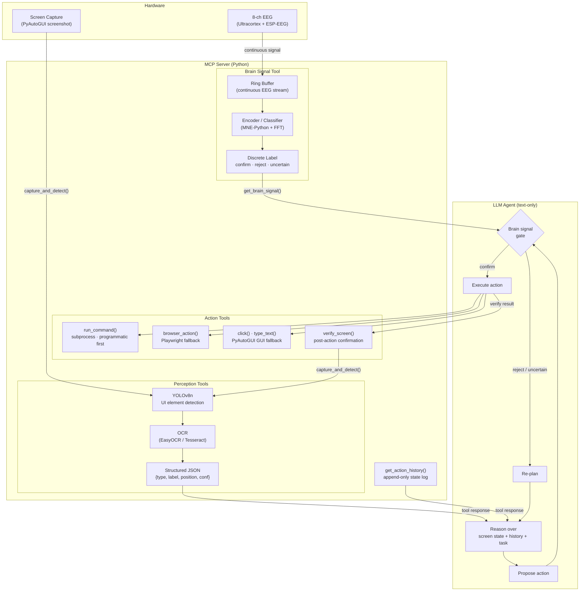

# BrainHacks 2026 Proposal 

TODOs:

1. resolve software integration issues: how to sample data from the EEG, visualization and tech stack for the EEG.
2. brainstorm the full data pipeline process with modified YOLOdex.
3. refine system design:
    1. 'action tree' for contextual information of previous agent actions
    2. how to structure agents properly: specialized subagents or one big agent? How to decide this?
    3. proper system design and fallback: when and how are the EEG signals used during inference? This question needs to be answered.

## Abstract

Recent advances in vision-language models (VLMs) have enabled a new class of autonomous desktop agents capable of interpreting screenshots and executing mouse and keyboard actions to complete user-specified tasks. However, VLM-based computer use agents are computationally expensive, opaque in their visual reasoning, and lack mechanisms for real-time human oversight during multi-step execution. We present **SCALP** (Signal-Conditioned Agent for Lightweight Perception), a brain-signal-augmented computer use agent that replaces the monolithic VLM with a decomposed architecture: a YOLOv8 object detector paired with OCR extracts structured text descriptions of on-screen UI elements, which are consumed by a text-only LLM for action reasoning. An 8-channel EEG headset (Ultracortex Mark III + Cerelog ESP-EEG) streams cortical signals through a lightweight encoder that produces discrete cognitive-state labels, enabling brain signals to act as an implicit runtime gate. Its use is to confirm or validate agent-proposed actions before execution, enabling more reliable agentic steering in both GUI and programmatic tool calling and executions. The system is exposed as a Model Context Protocol (MCP) server, allowing any MCP-compatible LLM client to connect and operate the agent. We evaluate SCALP on a constrained desktop task set and compare its cost, latency, and task completion rate against a baseline VLM agent, demonstrating that the decomposed YOLO + OCR + text-LLM pipeline achieves competitive accuracy at a fraction of the per-step inference cost, while providing an implicit human-in-the-loop safety mechanism through a passive brain-computer interface feedback.

## Introduction

Automating desktop interactions has been a longstanding goal in human–computer interaction. Early approaches relied on macro recorders, screen-scraping utilities, and accessibility-API-based scripting, with tools such as AutoHotkey (2003) and SikuliX [1], which worked by matching template screenshots to locate GUI elements to programmatically automate and execute actions. The industrial formalization of this approach, Robotic Process Automation (RPA), emerged through platforms like Blue Prism (2001), Automation Anywhere (2003), and UiPath (2005), enabling enterprises to automate repetitive workflows across applications. These systems remain fundamentally rule-based, which are brittle against UI layouts change and falls behind in generalizing to novel tasks without any manual re-programming.

The mainstream adoption of large vision-language models (VLMs) has enabled a paradigm shift toward general-purpose computer use agents. In October 2024, Anthropic released Claude Computer Use [2], the first major commercial system that gives AI models computer literacy by allowing an AI to observe a screen, move a cursor, click, and type in the same way a human does. In December 2024 and January 2025, OpenAI's Operator [3] and Google's Project Mariner [4] followed. Other academic works also produced increasingly capable GUI agents: CogAgent [5], an 18-billion-parameter VLM specialized for GUI understanding; SeeClick [6], which demonstrated that GUI grounding pre-training directly improves downstream agent performance; and WebVoyager [7], an end-to-end web agent achieving 59.1% task success across real websites. The OSWorld benchmark [8] established the first scalable evaluation environment for multimodal desktop agents, revealing that the best VLM agents achieved only 12.24% task success at the time of publication (compared to 72.36% for humans), with GUI element grounding identified as the primary bottleneck.

Despite this progress, VLM-based agents suffer from three limitations. First, they are **computationally expensive**: each decision step requires a full VLM inference over a high-resolution screenshot, making multi-step task execution costly. Second, their visual reasoning is **opaque**; the model's internal attention over the screenshot is not inspectable, making it difficult to diagnose failures or audit agent behaviour. Third and most critically, current agents provide **no mechanism for real-time human oversight** during execution, and once a task is delegated, the agent operates autonomously with no channel for the user to intervene short of manual interruption.

Recent work suggests that decomposing visual perception from reasoning can address the first two limitations. OmniParser [9] demonstrated that a fine-tuned YOLOv8 detector paired with OCR can parse screenshots into structured representations that improve VLM grounding from 16.2% to 73.0%. Agent S2 [11] showed that compositional architectures with specialized grounding modules outperform monolithic VLM approaches. However, these systems remain perception modules or VLM-augmentation tools, and lack an integrated agent harness with context engineering, state management, and execution hierarchy optimized for a text-only LLM (see Related Work).

The absence of human oversight connects to a parallel line of research in brain-computer interfaces (BCIs). Since Vidal's foundational proposal for direct brain–computer communication [12], the field has progressed from P300 spellers [13] and motor-imagery-based cursor control [14, 15] to passive BCIs that monitor cognitive states without requiring explicit user commands [16]. Passive BCIs leverage signals such as error-related negativity (ERN), which is generated when a user perceives a mismatch between an expected and observed outcome [17], and alpha-band power modulations that index attentional engagement. These signals provide a neurological channel through which a human can implicitly communicate approval, surprise, or error detection without pressing a button or speaking a word. Modern consumer-grade EEG hardware, while limited in channel count and signal quality compared to clinical systems, has been shown to reliably capture these coarse cognitive states [18, 19].

In this work, we present SCALP (Signal-Conditioned Agent for Lightweight Perception), a proof-of-concept system that bridges these two threads. SCALP replaces the monolithic VLM in a computer use agent with a decomposed architecture. YOLOv8 detects UI elements on screen, OCR extracts their text labels, and the resulting structured representation is fed to a text-only LLM that proposes actions through our agentic harness. An 8-channel dry-electrode EEG headset streams cortical signals through a lightweight encoder that classifies the user's cognitive state into discrete labels such as *confirm*, *reject*, and *uncertain*. The brain signal serves as a runtime gate, where the LLM proposes an action, the brain encoder provides a go/no-go signal, and only confirmed actions are executed. The entire system is implemented as a Model Context Protocol (MCP) server [20], exposing perception, brain-signal, and action-execution tools through a standardized interface that any MCP-compatible LLM client can consume.

Our contributions are as follows:

1. We propose an optimized agentic harness built on top of the decomposed architecture for computer use agents that replaces VLM-based perception with YOLO + OCR, reducing per-step inference cost while maintaining structured understanding of the screen state. Additionally, we present a cost effective data pipeline for training and labelling samples for lightweight YOLO models 
2. We introduce brain signals as a passive, implicit human-in-the-loop feedback mechanism for desktop agents, by providing a runtime safety gate that requires no manual intervention from the user.
3. We implement the system as an open MCP server, demonstrating that the perception–reasoning–action loop can be modularized through standardized tool interfaces, enabling model-agnostic and extensible agent architectures.
4. We evaluate SCALP on a constrained desktop task set, comparing task completion rate, per-step latency, and cost against a VLM-based baseline agent.

## System Architecture

## Project Implementation 

Please check [Implementation Proposal](implementation-proposal.md)

## Components 

Through this project, we aim to deliver a proof of concept using low budget EEG. We will

1. Build an EEG using the Ultracortex Mark III as the base, and a more budget friendly 8 channel PiEEG for the project.
2. Develop a data pipeline to sample and label brain signals + screen images and visual data.
3. Train an ensemble system to classify, predict and execute actions based on brain signals and prior desktop context.
4. Test and benchmark our system's effectiveness during usage.

The UltraCortex mark III was chosen over mark IV because the mark III proved to be more 3D printer friendly without the need for denser, injection moulded parts, and was perfect for a low budget use case.

# UltraCortex + PiEEG BoM

> **Frame sizing by head circumference:** Small = 50–55 cm | Medium = 55–60 cm | Large = 60–65 cm

| Part                             | Type        | Qty                  | Notes                                                                                                                                                                                                                                               | Link                                                                                                                                                                                                                                                                                                                                                                                                                                                                                                                                                                                                                                                                                                                                                                                                  | Price      |
| -------------------------------- | ----------- | -------------------- | --------------------------------------------------------------------------------------------------------------------------------------------------------------------------------------------------------------------------------------------------- | ----------------------------------------------------------------------------------------------------------------------------------------------------------------------------------------------------------------------------------------------------------------------------------------------------------------------------------------------------------------------------------------------------------------------------------------------------------------------------------------------------------------------------------------------------------------------------------------------------------------------------------------------------------------------------------------------------------------------------------------------------------------------------------------------------- | ---------- |
| FRAME_FRONT                      | 3D-Printed  | x1                   | .STLs available in small / medium / large                                                                                                                                                                                                           | [link](https://github.com/OpenBCI/Ultracortex/tree/master/Mark_III_Nova_REVISED/STLs/FRAME)                                                                                                                                                                                                                                                                                                                                                                                                                                                                                                                                                                                                                                                                                                           | Free       |
| FRAME_BACK                       | 3D-Printed  | x1                   | .STLs available in small / medium / large                                                                                                                                                                                                           | [link](https://github.com/OpenBCI/Ultracortex/tree/master/Mark_III_Nova_REVISED/STLs/FRAME)                                                                                                                                                                                                                                                                                                                                                                                                                                                                                                                                                                                                                                                                                                           | Free       |
| OCTANUT                          | 3D-Printed  | x9                   | .STLs available in tight / normal / loose: start with normal; switch to loose if too tight for OCTABOLT, or tight if too loose (print the FRAME first, then print the OCTANUTs)                                                                     | [link](https://github.com/OpenBCI/Ultracortex/tree/master/Mark_III_Nova_REVISED/STLs/MECH_PARTS/OCTANUT)                                                                                                                                                                                                                                                                                                                                                                                                                                                                                                                                                                                                                                                                                              | Free       |
| OCTABOLT                         | 3D-Printed  | x9                   | For holding electrode holders.                                                                                                                                                                                                                      | [link](https://github.com/OpenBCI/Ultracortex/blob/master/Mark_III_Nova_REVISED/STLs/MECH_PARTS/OCTABOLT_20.stl)                                                                                                                                                                                                                                                                                                                                                                                                                                                                                                                                                                                                                                                                                      | Free       |
| OCTARING                         | 3D-Printed  | x21 (x9 minimum)  | For holding Octabolts.                                                                                                                                                                                                                              | [link](https://github.com/OpenBCI/Ultracortex/blob/master/Mark_III_Nova_REVISED/STLs/MECH_PARTS/OCTARING.stl)                                                                                                                                                                                                                                                                                                                                                                                                                                                                                                                                                                                                                                                                                         | Free       |
| ELECTRODE_HOLDER                 | 3D-Printed  | x21  (x9 minimum) | For holding the electrodes (electrodes -> holders -> octabolt).                                                                                                                                                                                     | [link](https://github.com/OpenBCI/Ultracortex/blob/master/Mark_III_Nova_REVISED/STLs/MECH_PARTS/E_HOLDER.stl)                                                                                                                                                                                                                                                                                                                                                                                                                                                                                                                                                                                                                                                                                         | Free       |
| QUADSTAR                         | 3D-Printed  | x21                  | for mounting octabolts in curved areas. NOTE: TPU is to be used for this.                                                                                                                                                                           | [link](https://github.com/OpenBCI/Ultracortex/blob/master/Mark_III_Nova_REVISED/STLs/MECH_PARTS/QUADST`AR.stl)                                                                                                                                                                                                                                                                                                                                                                                                                                                                                                                                                                                                                                                                                        | Free       |
| Comfy Insert                     | 3D-Printed  | x12 minimum          | For positions without electrodes.                                                                                                                                                                                                                   | [link](https://github.com/OpenBCI/Ultracortex/blob/master/Mark_III_Nova_REVISED/STLs/MECH_PARTS/Comfy_Insert.stl)                                                                                                                                                                                                                                                                                                                                                                                                                                                                                                                                                                                                                                                                                     | Free       |
| OCTATOOL                         | 3D-Printed  | x1                   | Used for installing octabolts.                                                                                                                                                                                                                      | [link](https://github.com/OpenBCI/Ultracortex/blob/master/Mark_3/STLs/MECH_PARTS/OCTATOOL.stl)                                                                                                                                                                                                                                                                                                                                                                                                                                                                                                                                                                                                                                                                                                        | Free       |
| Spring 1 (weak)                  | Hardware    | x6                   | Weak spring for mounting spikey (dry comb) electrodes  CADEAU                                                                                                                                                                              | CADEAU                                                                                                                                                                                                                                                                                                                                                                                                                                                                                                                                                                                                                                                                                                                                                                                                | CADEAU     |
| Spring 2 (strong)                | Hardware    | x3                   | Strong spring for mounting non spikey electrodes  CADEAU                                                                                                                                                                                      | CADEAU                                                                                                                                                                                                                                                                                                                                                                                                                                                                                                                                                                                                                                                                                                                                                                                                | CADEAU     |
| Nuts (2-56 thread)               | Hardware    | x18                  | Anything equivalent to the link will work                                                                                                                                                                                                           | [link](https://www.mcmaster.com/91841A003/)                                                                                                                                                                                                                                                                                                                                                                                                                                                                                                                                                                                                                                                                                                                                                           | TBD        |
| Bolts (2-56 thread)              | Hardware    | x9                   | Anything equivalent to the link will work                                                                                                                                                                                                           | [link](https://www.mcmaster.com/91772A084/)                                                                                                                                                                                                                                                                                                                                                                                                                                                                                                                                                                                                                                                                                                                                                           | TBD        |
| Wiring                           | Hardware    | x11                  | Free (taken from Arduino Kit), Female-Male & Female-Female jumper wires                                                                                                                                                                             | N/A                                                                                                                                                                                                                                                                                                                                                                                                                                                                                                                                                                                                                                                                                                                                                                                                   | N/A        |
| Dry spikey electrodes            | Electrode   | x6                   | 5 mm Ag/AgCl Comb Electrodes — for nodes with hair                                                                                                                                                                                                  | [expensive link](https://shop.openbci.com/collections/frontpage/products/5-mm-spike-electrode-pack-of-30?_gl=1*18eqnqp*_gcl_aw*R0NMLjE3NzIyMTE5NjQuQ2p3S0NBaUFub1hOQmhBWkVpd0FuSXRjR3g5cjl0M3Zsd2M0dEdsaHd0TUVfaENOM2ZMQzYwMV83TzVYTnFod25VemFyaExEWTVZdHJ4b0N2aVlRQXZEX0J3RQ..*_gcl_au*MTYyODEzNzI4MC4xNzcwNjA1NTcxLjE4MzY5NjU3NDQuMTc3MjEzNDcxMi4xNzcyMTM2MjY2*_ga*NzEwNTg3Mzg4LjE3NzA2MDU1NzE.*_ga_HVMLC0ZWWS*czE3NzIzMDYwNDEkbzE0JGcxJHQxNzcyMzA2MTA2JGo2MCRsMCRoMA..)  [snap on](https://www.fri-fl-shop.com/products/reusable-5mm-ag-agcl-spike-snap-electrode-tde-212)                                                                                                                                                                                                                   |            |
| Dry non-spikey (flat) electrodes | Electrode   | x3                   | Disposable/Reusable Cup Wet/Dry EEG Electrode — for nodes without hair (e.g. forehead)                                                                                                                                                              | [link](https://www.fri-fl-shop.com/products/tde-201?_pos=4&_sid=d6ec6c966&_ss=r&variant=40151694835765)  Guide suggests buying pack, but pack does not fit use case with ESP-EEG (TODO: check)                                                                                                                                                                                                                                                                                                                                                                                                                                                                                                                                                                                                  |            |
| Ear Clip Electrode               | Electrode   | x2                   | TDI-430 Silver-Silver Chloride Ear Clip Electrode — used as reference  Will strip the universal conductors and solder stripped arduino wires + wrap electric tape around it instead of buying touch proof electrode adapters to reduce costs. | [linlk](https://www.fri-fl-shop.com/products/td-430-silver-disc-electrode-ear-clip?variant=40467191365685)  NOTE: OpenBCI connector is sold out, going for no wire and using Arduino female-female connectors as replacement                                                                                                                                                                                                                                                                                                                                                                                                                                                                                                                                                                    |            |
| **Cerelog ESP-EEG**              | Electronics | x1                   | ESP-EEG board to replace Cyton                                                                                                                                                                                                                      | [link](https://www.cerelog.com/eeg_researchers.html?gad_source=1&gad_campaignid=23532795753&gbraid=0AAAABCy3sQLmUMcTqGs6YOioXpdgOSTM1&gclid=CjwKCAiAnoXNBhAZEiwAnItcGxESrJgRviMB_qQ4u4yNc_0VX1lik7g1220OIRRLQFDzsLFUU9hCgRoCI44QAvD_BwE)                                                                                                                                                                                                                                                                                                                                                                                                                                                                                                                                                              | 476.99 CAD |
| 2000mah 3.7V battery             | Electronics | x1                   | 3.7V max 2000mAh battery for ESP-EEG                                                                                                                                                                                                                | [link](https://www.amazon.ca/Palogreen-103450-Rechargeable-Replacement-Bluetooth/dp/B0CKGY7YJ5/ref=sr_1_7?dib=eyJ2IjoiMSJ9.IwDBQW5GB8GSe7ASJlskDETF7GW2J7St-lbLQ5vTd0UpttYF1N3cdAkPLWoPmFYIlwITKYs0Kx28cQgkRl18RmMensVPdzPgvu1dUCgyJC8awHxNfjcPcjdpfCYC2JbwlPWMLohT3XpBL2L--8rE9H-kIUFEjvHAoDwIfBhpGwUm_RnDHs3R7ZDPFrZzgtjrB4sTx8eSx5QvYjFOOBVhX4m6v09OIeBo1xuByZPVFp39eUjHl8xu0dfHY82HPl5ikskRc6T49NKYjx4MVFA0z6hwiTfAi-G4Hv8gst5n-Fg.qa8V8HNyrDk2fTZp8iruUs3Jq-3u840MxTyNMFabIkU&dib_tag=se&gad_source=1&hvadid=788572029988&hvdev=c&hvexpln=0&hvlocphy=9189881&hvnetw=g&hvocijid=5636463814512125196--&hvqmt=e&hvrand=5636463814512125196&hvtargid=kwd-1929585510376&hydadcr=14436_13731640&keywords=3.7+2000mah+rechargeable+battery&mcid=a1ab59d014bb35e1b0fcdf2a5c2e83fe&qid=1772219316&sr=8-7) | 12.99 CAD  |
| Zip Ties                         | Misc        | x100 pack            | Used for wiring and the quadstars, each quadstar needs 4 zipties.                                                                                                                                                                                   | TBD                                                                                                                                                                                                                                                                                                                                                                                                                                                                                                                                                                                                                                                                                                                                                                                                   | TBD        |

> TODO: a verification/double checking is required for the electrodes and the components, for the spikey, non spikey, the springs for each, and the number of comfy inserts required for printing.

### Best Practices 

#### Soldering:

If you solder the wires correctly, there is **zero risk of signal loss** compared to using touch-proof adapters. In fact, a high-quality soldered joint is electrically superior to a mechanical "push-fit" connector because it provides a permanent, low-resistance metallic bond.

However, since you are dealing with microvolt-range ($\mu V$) brain signals, there are three specific risks—unrelated to the solder itself—that you must manage to ensure your AI agent receives usable data.

##### 1. The "Antenna Effect" (EMI/RFI)

The primary "loss" in EEG isn't the signal disappearing; it's the signal being drowned out by electrical noise.

- **The Risk:** When you snip off the shielded medical connectors and replace them with standard Arduino-style jumper wires, you are essentially creating an antenna.
- **The Fix:** Keep your "unshielded" section (where you soldered the joint) as short as possible. If your wires are long, **lightly twist** the pairs (e.g., twist the C3 wire with the Ground wire). This "twisted pair" technique helps cancel out electromagnetic interference from nearby electronics or lights.
    

##### 2. Cold Solder Joints and Microphonics

Because brainwaves are so tiny, the mechanical stability of your joint is more important than the "touch-proof" rating.

- **The Risk:** A "cold" solder joint (one that looks dull or grainy) can have high resistance that fluctuates when you move your head. This creates "microphonic" noise—massive spikes in your EEG data every time the wire jiggles.
- **The Fix:** Ensure you have a shiny, smooth solder joint and use **heat-shrink tubing** to provide "strain relief." The wire should not be able to bend right at the point where the solder ends, as that is where it is most likely to snap or create noise.

##### 3. Safety vs. Signal Quality

It is important to understand that "Touch-Proof" (DIN 42802) is a **safety standard**, not a signal-quality standard.

- **The Standard:** These connectors are designed with recessed pins so that a user cannot accidentally plug a head-mounted electrode into a wall socket or a high-voltage power supply.
- **The Reality for You:** Since you are strictly following the safety protocol of using **5V battery power** and have no connection to the electrical network, the safety "risk" of using exposed header pins is negligible for an engineering prototype.
- **Referencing:** Regardless of how you connect the wires, your AI project will fail without the **Reference and Bias (Ear Clips)**. These are what allow the ADS1299 chip to "subtract" the common noise from your brain signal.

# References

[1] T. Yeh, T.-H. Chang, and R. C. Miller, "Sikuli: Using GUI Screenshots for Search and Automation," in *Proc. UIST*, ACM, 2009.
[2] Anthropic, "Introducing computer use, a new Claude 3.5 Sonnet, and Claude 3.5 Haiku," Oct. 2024. https://www.anthropic.com/news/3-5-models-and-computer-use
[3] OpenAI, "Introducing Operator," Jan. 2025.
[4] Google DeepMind, "Project Mariner," Dec. 2024. https://deepmind.google/technologies/project-mariner/
[5] W. Hong et al., "CogAgent: A Visual Language Model for GUI Agents," in *Proc. CVPR*, 2024. arXiv:2312.08914.
[6] K. Cheng et al., "SeeClick: Harnessing GUI Grounding for Advanced Visual GUI Agents," in *Proc. ACL*, 2024. arXiv:2401.10935.
[7] H. He et al., "WebVoyager: Building an End-to-End Web Agent with Large Multimodal Models," in *Proc. ACL*, 2024. arXiv:2401.13919.
[8] T. Xie et al., "OSWorld: Benchmarking Multimodal Agents for Open-Ended Tasks in Real Computer Environments," in *NeurIPS Datasets and Benchmarks Track*, 2024. arXiv:2404.07972.
[9] Y. Lu et al., "OmniParser for Pure Vision Based GUI Agent," arXiv:2408.00203, 2024.
[10] S. S. Daneshvar and S. Wang, "GUI Element Detection Using SOTA YOLO Deep Learning Models," arXiv:2408.03507, 2024.
[11] S. Agashe et al., "Agent S2: A Compositional Generalist-Specialist Framework for Computer Use Agents," in *COLM*, 2025. arXiv:2504.00906.
[12] J. J. Vidal, "Toward Direct Brain-Computer Communication," *Annual Review of Biophysics and Bioengineering*, vol. 2, no. 1, pp. 157–180, 1973.
[13] L. A. Farwell and E. Donchin, "Talking off the top of your head: toward a mental prosthesis utilizing event-related brain potentials," *Electroencephalography and Clinical Neurophysiology*, vol. 70, no. 6, pp. 510–523, 1988.
[14] J. R. Wolpaw et al., "An EEG-based brain-computer interface for cursor control," *Electroencephalography and Clinical Neurophysiology*, vol. 78, no. 3, pp. 252–259, 1991.
[15] G. Pfurtscheller and C. Neuper, "Motor Imagery and Direct Brain-Computer Communication," *Proceedings of the IEEE*, vol. 89, no. 7, pp. 1123–1134, 2001.
[16] T. O. Zander and C. Kothe, "Towards passive brain-computer interfaces: applying brain-computer interface technology to human-machine systems in general," *Journal of Neural Engineering*, vol. 8, no. 2, 025005, 2011.
[17] C. Walter et al., "Cognitive state monitoring and the design of adaptive instruction in digital environments," *Frontiers in Neuroscience*, vol. 8, p. 385, 2014.
[18] X. Gu et al., "EEG-Based Brain-Computer Interfaces (BCIs): A Survey of Recent Studies on Signal Sensing Technologies and Computational Intelligence Approaches," *IEEE Access*, vol. 9, 2021.
[19] M. Rashid et al., "Current Status, Challenges, and Possible Solutions of EEG-Based Brain-Computer Interface: A Comprehensive Review," *Frontiers in Neurorobotics*, vol. 14, p. 25, 2020.
[20] Anthropic, "Introducing the Model Context Protocol," Nov. 2024. https://www.anthropic.com/news/model-context-protocol
[21] Y. Fu, R. Anantha, P. Vashisht, J. Cheng, and E. Littwin, "UI-JEPA: Learning UI Embeddings with Joint Embedding Predictive Architectures," arXiv:2409.04081, 2024.
[22] Y. Song et al., "ActionEngine: A Training-Free Framework for GUI Agents via State Machine Memory," arXiv:2602.20502, 2025.
[23] E. Pappas, "The Agent Harness Is the Architecture — And Your Model Is Not the Bottleneck," 2025.
[24] JetBrains Research, "Efficient Context Management for LLM-Powered Agents," Dec. 2025.
[25] Anthropic, "Effective Context Engineering for AI Agents," 2025. https://www.anthropic.com/engineering/effective-context-engineering-for-ai-agents
[26] OpenAdaptAI, "OmniMCP," https://github.com/OpenAdaptAI/OmniMCP, 2024.

# Hardware Sources

1. [Ultracortex electrodes](https://openbci.com/forum/index.php?p=/discussion/921/ultracortex-mark-iv-electrodes-units)
2. [Ultracortex Mark IV Documentation](https://docs.openbci.com/AddOns/Headwear/MarkIV/#3d-printed-parts)
3. [Ultracortex Mark III Documentation](https://docs.openbci.com/Deprecated/MarkIII/)
4. [Ultracortex Mark III Source Files](https://github.com/OpenBCI/Ultracortex/tree/master/Mark_III_Nova_REVISED)
5. [DIY custom EEG implementation with ESP32](https://hackaday.io/project/178007-esp32-eeg)
6. [Cerelog ESP-EEG details](https://www.reddit.com/r/BCI/comments/1polj4b/i_designed_an_open_source_8channel_eeg_board/)

